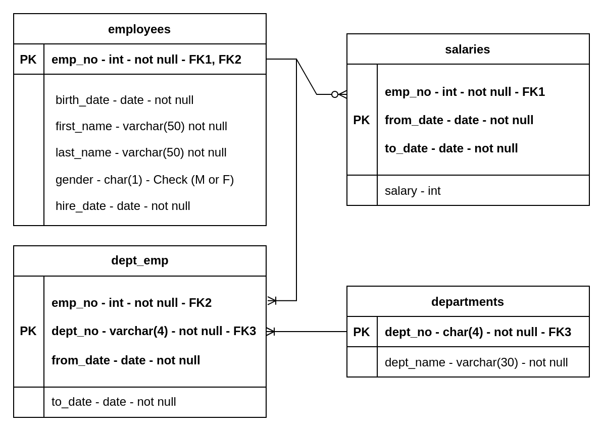

# Sunshine Desert Database

### A data analysis project to showcase salary trend, employee churn and gender balance within a company

This is a data analysis project for Cenit College's Data analysis course. This project is made with the use of **SQL**, **Tableau** and **SQL sever management studio**
## **Table of Content**
* [Overview](#overview)
* [Database Model](#database-model)
* [Salary Trend Analysis](#salary-trend-analysis)
* [Gender Balance Analysis](#gender-balance-analysis)
* [Employee Churn Analysis](#employee-churn-analysis)
* [Additional Insight](#additional-insight)
* [Conclusion](#conclusion)

***
## **Overview**
The Sunshine Desert Project is a data-driven analysis focused on evaluating business performance across a defined time period. The project involved retrospective analysis of key metrics such as salary spend, gender balance, and employee churn from 1991 to 2001. Using SQL for data extraction and manipulation, and Tableau for interactive data visualization, the project aimed to uncover patterns and insights to support strategic decision-making.

Key deliverables included trend dashboards, churn analysis reports, and gender diversity visualizations, all designed to offer actionable insights to stakeholders. The project demonstrated strong skills in data querying, dashboard creation, and storytelling through data.

## **Database Model**
Microsoft SQL server management studio and Tableau is used for the project. Microsoft power point is used for the presentation.
The schema for the project is developed like below.

## **Salary Trend Analysis**
Salary Trend analysis spans from 1991 to 2001, a period marked by various economical fluctuations. 
To ensure comparability, all salaries were adjusted to 2001 US dollars using the U.S. Consumer Price Index.
The Development, Production, and Sales departments consistently accounted for the highest levels of spending, indicating a central role in the organization.

From 1991 to 1999, there is a clear upward trend in salary expenditure across all departments, suggesting steady growth. However, post-1999, the data reveals a decline in total salary expenditure and headcount also, potentially indicating organizational downsizing or the economic constraints during that period.

The table shows the percentage departmental share of total salary expenditure for the years 1991 and 2001 and the changes. the Customer Service department had the biggest increase in share of 1.7% while Sales had the largest decline of −1.5 percent in that period of time. This shift may reflect a strategic reallocation of resources.

## **Gender Balance Analysis**
The red lines on the gender balance chart are US national unadjusted and adjusted average salary biases. The women earned between 98 and 101% of their male counterparts depending on department and all departments are well above the national average.

In the table the salary bias figures for 1991 and 2001. Women on average at the company earn very slightly more than men. However these data do not preclude there being gender bias issues within departments.

## **Employee Churn Analysis**
For 2001, overall Customer Service, Research and Production are the top 3 in Churn rate with 3.1% and 3%. Interestingly more women are leaving from CS and Production while more men are leaving from Research. Research coincidentally has the highest churn for men and Quality the lowest while Production has the highest for Women and Marketing the lowest.
Looking at churn rate across the company between 91 - 2001, it’s relatively low compared to the market which seems to be a good sign. People are generally happy and want to stay with the company for the long run. The only year where churn is relatively higher across departments is 2000 which could warrant further analysis to look into the reasons. Based on 10 years of data, no department is more susceptible to churn than another overall.

## **Additional Insight**
Over the 11 years from 1991 to 2001 we can see salary expenditure decreasing across all departments, while in turn the staff numbers are increasing across all departments, but we see significant staff number increases in Development, Production and Sales.  Is the reason for those 3 significant increases understood by Management?

For Gender, its distribution differs notably across departments. The gender balance chart here compares each department to the U.S. national average for 2001, with department percentages displayed to the right. While some departments align closely with the national average, others deviate significantly.

And finally, we see high rates of Female churn in Production and Male churn in Research, Marketing and Finance. Further analysis would be needed to determine the root cause, for example, is it due to management style, salary reduction, heavy workload etc.

## **Conclusion**
Sunshine desert is a company that expanded significantly between 1991 and 2001
Their gender salary bias and employee turnover are better than average for the US and their salaries seem very generous for what appears to be a manufacturing company.
However, the discrepancy in the input data we were given leads us to question the completeness of the dataset provided to us and that should be checked.
There are gender balance differences in churn between departments that could be improved and we suggest that staff be surveyed to try determine if there is a cultural cause.

